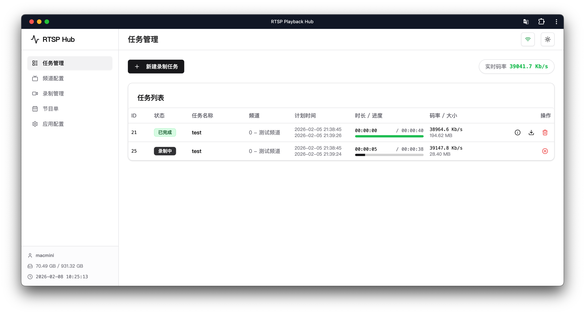
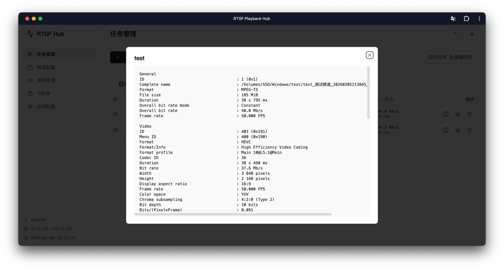

# RTSP 录制服务 (RtspRecServer)

一个基于 .NET 10 和 React 构建的高效 RTSP 回放流录制工具，提供现代化的 Web 管理界面。

> **⚠️ 免责声明**
>
> 本项目仅供学习和测试使用。开发者不对使用本软件产生的任何后果负责。请务必遵守当地法律法规，不得将本软件用于任何非法用途。

> **🤖 AI 生成声明**
>
> 本项目的所有代码（包括后端逻辑、前端界面及文档）均由 AI 辅助生成。代码质量可能参差不齐，仅供参考和实验，请勿对代码规范性抱有过高期待。

## ✨ 主要功能

- **RTSP 录制**：支持定时录制和手动录制。
- **Web 管理界面**：提供直观的网页界面，支持深色/浅色模式，方便管理任务。
- **协议支持**：专注于 IPTV 回放场景，**仅支持 MP2T/TCP 和 MP2T/RTP/TCP 协议**。
- **EPG 电子节目单**：支持导入节目单。
- **低资源占用**：采用 NativeAOT 技术编译，启动快，占用低。

## 🛠️ 技术栈

- **后端**：.NET 10 (Minimal API)、System.Text.Json (Source Generator)
- **前端**：React 18、TypeScript、Vite、Tailwind CSS、Shadcn/ui
- **通信**：WebSocket (实时状态推送)
- **编译**：NativeAOT (提前编译为原生机器码)

## 📁 项目结构

```
.
├── src
│   ├── backend
│   │   ├── Server        后端服务入口与 API
│   │   └── Shared        共享模型与工具
│   └── frontend          前端管理界面
├── publish               发布输出目录
└── README.md
```

## 📸 界面截图





## 🚀 快速开始

### 运行环境

本软件为绿色版，解压即用。但在使用“查看信息”功能时，需要系统已安装以下工具：

- **MediaInfo**：用于读取录制文件的媒体信息（分辨率、码率等）。请确保 `mediainfo` 命令在系统环境变量中，或者与程序在同一目录下。

### 启动方式

1. 下载并解压程序包。
2. 双击运行主程序（`Server` 或 `Server.exe`）。
3. 程序启动后，会自动打开浏览器访问管理页面（通常为 `http://localhost:8080`）。

## ⚙️ 简单配置

程序运行目录下有两个主要的配置文件，修改后重启程序生效。

### 1. 基础设置 (`recsettings.json`)

```json
{
    "port": 8080,              // Web 界面端口
    "recordPath": "./records", // 录像保存路径
    "maxRecordingTasks": 1     // 最大同时录制任务数
}
```

### 2. 频道列表 (`channels.json`)

在这里添加你要录制的 RTSP 地址。

```json
[
  {
    "id": 0,
    "name": "CCTV-1",
    "url": "rtsp://example.com/stream1"
  }
]
```
